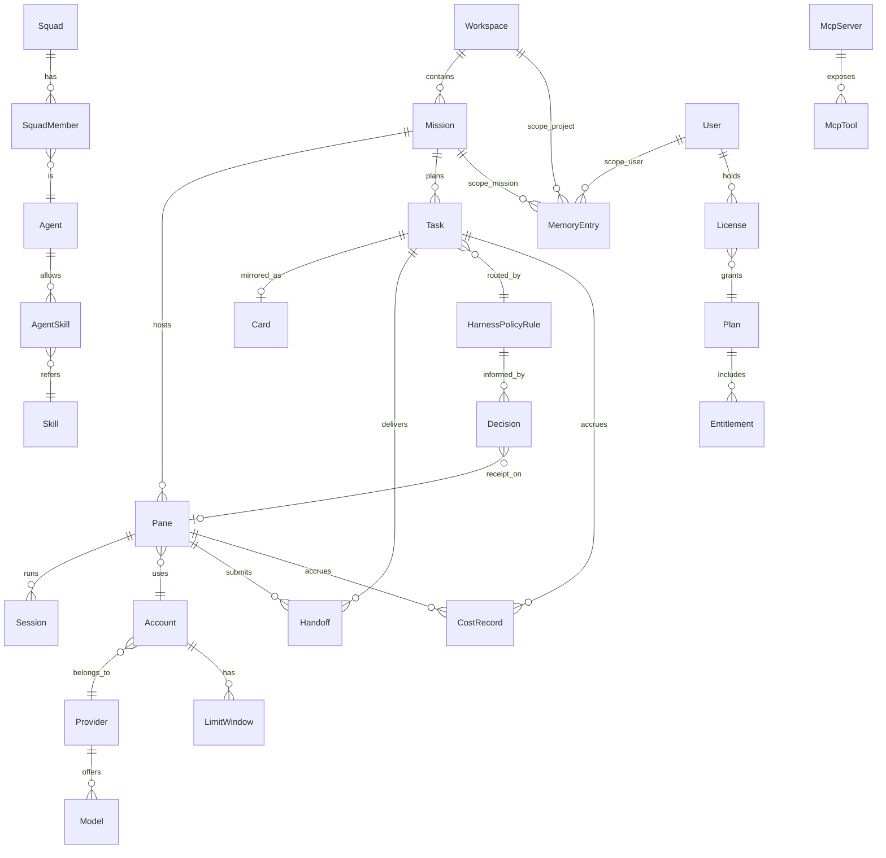
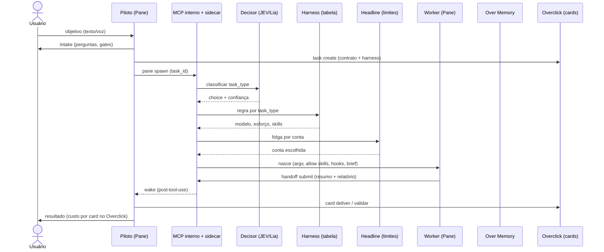
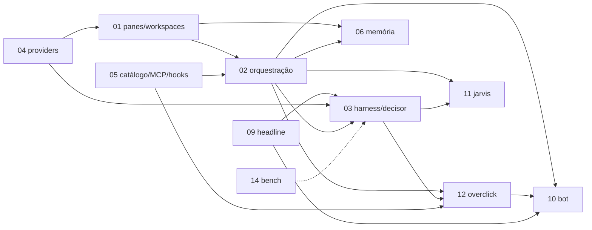

# spec-00 — Visão, arquitetura e glossário

Selos usados em toda afirmação: **[OBS]** observado nas lives (módulo/dia entre parênteses; "mNN" = `modulos-logicos/NN-*.md`, "Dia N" = número da live, não data); **[DEC]** decisão desta autora de spec, com justificativa de uma linha; **[LAC]** lacuna que exige decisão do dono do produto. Entidades em PascalCase, campos e eventos em snake_case, ambos em inglês.

---

## 1. O que é o produto e para quem

### 1.1 ADE, não IDE
- O Overclock se define como **ADE** (Agentic Development Environment) e não como IDE: "você troca a IDE por um time de agentes" [OBS m02, Dias 53/63/67/76]. Não edita código em um editor próprio; hospeda terminais reais de CLIs de IA e orquestra o trabalho entre eles [OBS m01, Dia 55].
- Não é wrapper de API nem revende tokens: "o Overclock é o chassi, a LLM é o motor, a assinatura é a gasolina" [OBS m01, Dia 73]; o app usa o login de cada CLI (equivale a abrir o terminal e digitar `claude`) [OBS m01, Dia 55; m04]. Exceções que pedem chave do usuário: Jarvis (Google/Gemini), decisor JEV (OpenRouter), Voice (Groq) [OBS m04].

### 1.2 Tese
1. **Modelo caro em cima, baratos embaixo**: um piloto inteligente só planeja e delega; workers executam [OBS m02, Dia 58 "regra de ouro"].
2. **"O modelo não é o teto, o harness é"**: o ganho vem de casar modelo + CLI + skills + conta por *tarefa*, não por categoria de domínio [OBS m03, Dias 65 e 82].
3. **Visibilidade**: nada roda em background oculto; todo sub-agente é um Pane visível [OBS m01/m02, Dias 23-28].
4. **As IAs não conversam entre si; quem conversa é o piloto que delega** [OBS m02, Dia 76]. O Overclock em si não gasta tokens: expõe o MCP; a economia vem de delegar.

### 1.3 Para quem
- Vibe coders e devs brasileiros, 25-45 anos, com uma ou mais assinaturas de CLI de IA [OBS m01 M01 Soft, Dia 24; m17]; base observada de ~229 assinantes no Dia 85 [OBS m19]. Usuários Windows foram 68% de uma enquete (Dia 58) [OBS m01].

### 1.4 Posicionamento em uma página
| Eixo | IDE tradicional | Overclock (ADE) |
|---|---|---|
| Unidade de trabalho | arquivo/editor | Pane (terminal real) dentro de Mission |
| Escolha do modelo | manual/fixa | política de harness + decisor por tarefa |


---

## 2. Mapa de componentes e diagrama

### 2.1 Componentes
| # | Componente | Papel | Spec |
|---|---|---|---|
| C1 | App desktop (casca, renderizador Overdrive, SQLite local) | chassi: Workspaces, Missions, Panes | 01 |
| C2 | Panes/CLIs | terminais PTY de cada CLI (ou browser interno/shell) | 01, 04 |
| C3 | MCP interno + sidecar (Arms) | API que o piloto usa para abrir/ler/escrever Panes, handoff, missões | 02, 05 |
| C4 | Orquestração (piloto, workers, squads, torre) | modos livre/squad/agêntico | 02 |
| C5 | Harness + Decisor (JEV/Lia) + roteador de contas | escolhe provider/modelo/esforço/skills/conta | 03 |
| C6 | Providers e contas | detecção de CLIs, multi-conta, modelos | 04 |
| C7 | Catálogo de skills/MCPs/hooks/regras | descoberta, portabilidade, `allow skills` | 05 |
| C8 | Over Memory | memória de pane/missão/projeto/usuário, brief de restore | 06 |
| C9 | Satélites: Voice, Shot, Headline | ditado PT→EN; captura; limites/ARR na barra | 07, 08, 09 |
| C10-C13 | Bot/relay/VPS (10); Jarvis/Open Jarvis (11); Overclick (12); Bench (14) | Overclock 24h e iPhone; voz sobre o MCP; board de cards; bench que alimenta o harness | 10, 11, 12, 14 |

### 2.2 Diagrama (mermaid)
```mermaid
flowchart TB
  subgraph Desktop["App desktop (C1)"]
    WS[Workspace] --> MI[Mission]
    MI --> PN[Panes / CLIs (C2)]
    DB[(SQLite local)]
    MCP[MCP interno + sidecar Arms (C3)]
    PN <--> MCP
    ORQ[Orquestração: piloto/workers/squads (C4)] --> MCP
    MEM[Over Memory (C8)] --- DB
    CAT[Catálogo skills/MCPs/hooks (C7)] --- MCP
    HAR[Harness + Decisor (C5)] --> MCP
  end
  PROV[Providers e Contas (C6)] --> PN
  HAR --> PROV
  HL[Headline: limites (C9)] --> HAR
  JEV[[JEV via OpenRouter / Lia local]] --> HAR
  BENCH[Bench (C13)] -. alimenta tabela .-> HAR
  VOICE[Voice (C9)] -- prompt em inglês --> PN
  SHOT[Shot (C9)] -- caminho da imagem --> PN
  JARVIS[Jarvis / Open Jarvis (C11)] --> MCP
  OCK[Overclick board (C12)] <--> MCP
  BOT[Bot + relay + VPS (C10)] --> MCP
  IOS[App iPhone] --> RELAY[[Relay de pareamento]] --> BOT
  DISC[Discord: Zero] --> OCK
  BACK[(Supabase / Stripe / GitHub Releases)] -. licença, plano, update .-> Desktop
  BACK -. plano .-> VOICE & SHOT & HL
```

### 2.3 Diagrama (ASCII)
```
             +------------------------- APP DESKTOP --------------------------+
 Voice -->   | Workspace > Mission(worktree) > Pane[CLI]  x N                  |
 Shot  -->   |        ^ spawn/read/write/handoff (MCP + sidecar "Arms")        |
 Jarvis -->  |   Piloto ---> Workers      Harness+Decisor ---> Conta/Modelo    |
 Bot/VPS --> |   Over Memory (aneis)      Catalogo (allow skills)   SQLite     |
             +-----+----------------+--------------------+---------------------+
                   |                |                    |
             Providers/Contas   Headline (limites)   Overclick (cards, MCP)
             (CLIs logadas)     JEV/Lia (decisao)         ^
                                Bench (tabela)            |  Discord -> Zero
   iPhone -> relay -> Bot(VPS 24h)                        +--> Overrunner (planejado)
   Backend: Supabase(login) Stripe(plano) GitHub Releases(update) overclock.sh
```

---

## 3. Glossário canônico

Grafias ruidosas normalizadas ("Tesque" → Task; "Warners/Horners" → Harness; "pen/pain/PN" → Pane; "Jeev" → JEV) [OBS m02, m03]. Termos como Session, Arsenal/Receita, Intake, Wake (post-it), Cadeado, Founder, Cofre, Catálogo, Bench, Zero/Overrunner e Overlabs são definidos nas specs 01-06, 12 e 14 [DEC: evita duplicar definição]; "missão" do App e do Overclick é o mesmo conceito no modo agêntico [OBS m02/m12].

| Termo | Definição | Selo | Spec |
|---|---|---|---|
| **ADE** | Agentic Development Environment; categoria do produto (§1) | [OBS m02] | 00 |
| **Pane** (painel/terminal) | terminal real (PTY) que hospeda uma CLI, browser interno ou shell. UI: "+ terminal" (votação Dia 61), site: "painel". Identificador `Pane` [DEC: a maioria das falas e do MCP usa "pane"] | [OBS m01] | 01 |
| **Workspace** | projeto base; contém Missions; define isolamento de acesso externo | [OBS m01, Dia 24] | 01 |
| **Mission** | item paralelo dentro do Workspace, com worktree git e grade de Panes próprios; no modo agêntico é a unidade com cards e memória | [OBS m01/m02] | 01, 02 |
| **Session** | conversa retomável de uma CLI dentro de um Pane; "sessões por workspace" somem da UI em favor de Missions e memórias [OBS m06]; entidade separada de Pane porque o ID do Pane é descartável [DEC] | [OBS+DEC] | 01, 06 |
| **MissionMode** | `free` (livre), `squad`, `agentic` (harness) | [OBS m01, Dia 44/73/76] | 02 |
| **Task** (Tesque) | atividade numerada com itens e status aberto/feito/validado, hoje em Markdown (briefing .md) [OBS m02]; no Overclick a Task é o **Card** | [OBS m02/m12] | 02, 12 |
| **Card** | Task no board do Overclick: contrato "o quê, por quê, como confirmo", harness recomendado, "para quem devolve" | [OBS m12] | 12 |
| **Policy / HarnessPolicy** | tabela `task_type → {cli/modelo, esforço, skills, agente, conta}`; "o cara certo, com o carro certo, para a atividade certa" | [OBS m03] | 03 |
| **Harness** | casamento motor (LLM) + carro (CLI); 4 níveis de maturidade (nível 4 = por atividade + várias contas) | [OBS m03, Dia 67] | 03 |
| **Decision** | resultado de uma consulta ao decisor: `choice`, `score` ou `boolean`, com probabilidades/confiança e custo; exibido como "recibo" no Pane | [OBS m03] + nome da entidade [DEC] | 03 |
| **JEV / Jeev / Lia** | JEV: modelo de decisão (Type Safe, via OpenRouter), só classifica entre opções fechadas, ~USD 0,0002/decisão; Lia: decisor local testado (16 de 48 acertos vs 45 do JEV). "Recibo" = registro no Pane de quem escolheu, confiança e fonte | [OBS m03, Dia 80] | 03 |
| **Squad** | time pré-montado de Agents por cargo, com receita (cinema site, SaaS 10K, website...) | [OBS m02, Dia 33] | 02 |
| **SquadRole** | cargo: `orchestrator`, `executor`, `scout`, `reviewer`; vocabulário também cita `planner`, `builder` | [OBS m02] enum fechado [DEC: união do que foi dito] | 02 |
| **Agent** | identidade + CLI + LLM + skills permitidas + tools + cargo; cargo só no cadastro do Agent | [OBS m02/m05] | 02, 05 |
| **Piloto** (orquestrador) | Pane fixo (esquerda) de LLM cara que só planeja e delega; identidade pertence ao Pane (piloto persistente, v1.4) | [OBS m02, Dia 75] | 02 |
| **Worker** | Pane que executa um card/tarefa e devolve via handoff; ID descartável | [OBS m02] | 02 |
| **Handoff** | entrega do worker ao chamador (`handoff submit`), resumo curto (~300-400 caracteres) + relatório em arquivo | [OBS m02, Dia 51/61] | 02, 05 |
| **Skill** | pasta `SKILL.md` portável entre CLIs (symlink/convert) | [OBS m05] | 05 |
| **allow skills** | parâmetro do Claude Code que abre só as skills do tipo de tarefa | [OBS m05, Dia 82] | 03, 05 |
| **McpTool** | tool exposta por um MCP (Overclock, Overclick, Headline...) | [OBS m05] | 05 |
| **MemoryEntry** | unidade de memória curta (decisão, fato, preferência), não dump de chat; entidade [DEC: m06 só descreve campos] | [OBS+DEC] | 06 |
| **MemoryRing** | anel de escopo: `mission` (quente), `project` (destilada), `user` | [OBS m06, Dia 49] | 06 |
| **Brief** | markdown curto injetado no restore de um Pane (checkpoint, decisões, riscos, eventos) | [OBS m06, Dia 29] | 06 |
| **Provider** | origem de modelos + autenticação + CLI (Claude Code, Codex, Gemini/`agy`, Kimi, Grok, OpenRouter...) | [OBS m04] | 04 |
| **Account** | login de um Provider (multi-conta; conta 1/conta 2) | [OBS m04/m03] | 04, 03 |
| **Headline** (Redline) | widget de limites na barra do sistema; MCP com `headline pick` | [OBS m09] | 09 |
| **Plan** | Boost, Pro, Ultra (ver §6) | [OBS m17] | 00 (§6) |
| **Entitlement** | direito de uso de uma feature derivado do Plan/licença; entidade [DEC] | [DEC] | 00 (§6) |
| **Overdrive** | motor de renderização 1.3: um só canvas/webview, Panes como regiões pintadas; 32 Panes em ~2 s, 64 em ~5 s | [OBS m01, Dias 54-55] | 01 |
| **Sinaleira** | status do Pane: verde pronto, amarelo trabalhando, vermelho aguarda usuário | [OBS m01, Dia 81] | 01 |
| **Sidecar / Arms** | processo do app que o MCP fala; "Arms" = plugin MCP (~54 tools) do piloto ("braço antes do mouse") | [OBS m10, Dia 69] | 10, 02 |
| **cloquinho** | mascote do Overclock e bot-orquestrador padrão do Overclock Bot | [OBS m10] | 10 |
| **Overclock Bot** | Overclock 24h em VPS controlado por chat (iPhone/desktop) | [OBS m10] | 10 |
| **Voice (Clock Voice)** | ditado; modo Code traduz PT→EN | [OBS m07] | 07 |
| **Shot** (Overshot) | captura de tela/gravação com frames; grátis para Ultra | [OBS m08] | 08 |
| **Jarvis / Open Jarvis BR** | assistente de voz ciente do workspace / versão open source em Rust | [OBS m11] | 11 |
| **Overclick** | board de cards open source com MCP, "ClickUp dos vibe coders" | [OBS m12] | 12 |

---

## 4. Modelo de dados canônico compartilhado

### 4.1 Diagrama ER


### 4.2 Entidades transversais
Campos comuns a toda entidade persistida: `id`, `created_at`, `updated_at`, `schema_version` [DEC: uniformiza migrações do SQLite local].

| Entidade | Campos-chave (além dos comuns) | Base |
|---|---|---|
| `Workspace` | `name`, `color`, `root_path`, `kind` (`local`\|`ssh`), `external_access` (`none`\|`read`\|`read_write`, padrão `read_write`), `ssh_host_ref` | [OBS m01, Dia 26/28: dois níveis configuráveis, padrão editar tudo] |
| `Mission` | `workspace_id`, `mode` (MissionMode), `worktree_path`, `branch`, `status`, `pilot_pane_id`, `board_mission_id?` | [OBS m01/m02/m12] |
| `Pane` | `mission_id`, `display_id` (inteiro exibido, ex. PN 325), `kind` (`cli`\|`browser`\|`shell`), `provider_id`, `model_id`, `account_id`, `effort`, `role` (SquadRole?), `is_pilot`, `status` (`ready`\|`working`\|`needs_user`\|`closed`), `origin` (`own`\|`external_tmux`), `caller_pane_id?` | [OBS m01/m02]; "o mesmo ID nunca volta" [OBS m02, Dia 61] |
| `Session` | `pane_id`, `cli_session_ref`, `transcript_ref`, `last_used_at` | [DEC] |
| `Task` | `mission_id`, `title`, `contract` (what/why/how_to_confirm), `task_type`, `state` (`open`\|`done`\|`validated`), `assignee_pane_id?`, `return_to` (quem revisa), `brief_md_path` | [OBS m02/m12: estados, três papéis] |
| `Handoff` | `task_id`, `from_pane_id`, `to_pane_id`, `summary` (curto), `report_path`, `resolved_in?` | [OBS m02/m12] |
| `Account` | `provider_id`, `label` (conta 1/2), `credential_ref` (nunca o segredo), `enabled` | [OBS m04/m03]; segredo no Cofre [DEC] |
| `LimitWindow` | `account_id`, `window` (`5h`\|`weekly`\|`monthly`), `used_pct`, `resets_at` | [OBS m09] |
| `HarnessPolicyRule` | `task_type`, `cli`, `model_id`, `effort`, `skill_ids[]`, `agent_id?`, `fallback_model_id?`, `source` (`bench`\|`user`) | [OBS m03] |
| `Decision` | `kind` (`choice`\|`score`\|`boolean`), `question`, `options[]`, `chosen`, `confidence`, `decider` (`jev`\|`lia`\|`table`), `latency_ms`, `cost_micros`, `pane_id?` | [OBS m03]; campos exatos [DEC] |
| `Agent` | `name`, `role`, `cli`, `model_options[]`, `skill_ids[]` (allowlist), `tool_ids[]` | [OBS m02/m05] |
| `MemoryEntry` | `ring` (MemoryRing), `scope_id`, `text`, `source_event_id`, `redacted` | [OBS m06] campos [DEC] |
| `License` / `Plan` / `Entitlement` | `user_id`, `plan_key`, `status`, `bound_ip?`; `key`; `feature_key` | [OBS m17/m18]; modelo [DEC] |

### 4.3 Convenções [DEC]
- **Ids**: ULID em texto com prefixo de tipo (`pane_01J...`, `mission_...`), gerados no cliente; justificativa: ordenáveis, sem coordenação, servem local e no Overclick cloud. Além disso, `Pane.display_id` inteiro curto e nunca reutilizado (o produto já exibe "PN 325" e diz que o ID de Pane é descartável [OBS m02, Dia 61]).
- **Timestamps**: UTC, ISO 8601 com milissegundos (`2026-09-29T12:00:00.000Z`), sufixo `_at`; duração em `_ms`. Justificativa: três SOs, sem ambiguidade de fuso.
- **Dinheiro**: inteiro em micro-unidades (`cost_micros`) + `currency`; justificativa: as lives misturam R$/US$/tokens sem unidade [OBS m12, m02] [LAC unidade oficial de exibição].
- **Segredos**: entidades guardam `*_ref`, nunca o valor; valores ficam no Cofre e são removidos de logs/brief [OBS m06 (segredos removidos do brief), m03 (broker)].
- **Eventos**: `entidade_verbo` em snake_case passado (`pane_spawned`, `handoff_submitted`, `decision_made`, `limit_reached`, `session_migrated`); [DEC] cada spec define seus eventos com esse padrão.
- **Escrita em SQLite** em transação para fluxos multi-escrita (`update mission`, `close pane`), pois a auditoria apontou a falta [OBS m06/m01, Dia 28].

---

## 5. Fluxos ponta a ponta

### 5.1 Fluxo A — tarefa no modo agêntico (caminho feliz)
1. O usuário (texto, Voice ou Jarvis) descreve o objetivo ao **piloto** na Mission `agentic` [OBS m02, Dia 75].
2. O piloto faz **intake** (para quem, dor, o que fica de fora) e cria **Tasks** (cards com contrato) em ondas [OBS m02, m12].
3. Para cada Task, o piloto chama o MCP (`pane spawn`) sem escolher modelo/conta [OBS m03, Dia 81].
4. O **Decisor** classifica o `task_type` (ex.: fix de bug) com confiança e a **HarnessPolicyRule** fornece modelo, esforço, skills e agente ("fonte: tabela") [OBS m03].
5. O roteador consulta **LimitWindow** (Headline) e escolhe a **Account**: a que termina primeiro; só usa outra se a primeira estiver a 100% [OBS m03 Dias 80-81] [LAC algoritmo final: m03 registra duas formulações e um bug].
6. O Pane worker nasce com prompt por argv, `allow skills` da tarefa e hooks (2 stop hooks + session-start), recebe o **Brief**/anel de memória por token de escopo [OBS m02, m05, m06].
7. O Pane mostra o **recibo** e a sinaleira (amarelo) [OBS m03/m01].
8. O worker executa; ao tentar encerrar sem handoff, o stop hook o força a continuar [OBS m02, Dia 51].
9. O worker chama `handoff submit`; o hook post-tool-use acorda o piloto [OBS m02].
10. O reviewer (cargo obrigatório antes de "done") valida; o card vai a Feito/Validado [OBS m02 Dia 33; m12].
11. Estado nos Panes/Mission é persistido em SQLite; `CostRecord` por Pane/modelo é gravado localmente [OBS m02, Dia 75: o app mede, o board só recebe custo se o worker reporta] [LAC fechar o gap].
12. No fechamento da Mission, a memória do anel `mission` é destilada para o anel `project` [OBS m06, Dia 49 desenho; implementação não verificada].
13. O piloto responde ao usuário com o resumo; o custo por card/missão aparece no Overclick [OBS m12].



### 5.2 Fluxo B — bug do Discord até release [OBS m12 Dia 70, m13]
1. Usuário posta no fórum de bugs; **Zero** entrevista, dedup (`task search`) e cria card `bug` no **Overclick**.
2. O fundador diz "resolve o 260"; o Overclock lê o ticket via MCP/hooks, cria a Mission, executa (Fluxo A) em branch.
3. Gera pré-release (ex.: só Windows x64), o fundador valida e publica como oficial. O **Overrunner** (execução sem humano) é apenas planejado [OBS m13; m19].

### 5.3 Fluxo C — limite estourado [OBS m03, Dias 55/58/81/84]
1. `limit_reached` na Account do Pane → o modelo esgotado fica desabilitado no seletor.
2. Manual: botão "mover" migra a Session para outra Account; automático: beta na 1.4.
3. [OBS m03, Dia 84] o "mover" não preservou o pensamento da sessão; [DEC] o contrato mínimo é preservar Brief + último checkpoint (spec-06) e avisar o usuário da perda.


---

## 6. Planos e entitlements transversais

Sem preços como requisito. [DEC] Preços, cupons e funil são política comercial (m17) e mudam sem alterar a arquitetura; as specs só consomem `feature_key`.

### 6.1 Plano × feature (apenas o observado)
| Feature (`feature_key`) | Boost/Livre | Pro | Ultra | Observação |
|---|---|---|---|---|
| `panes_multi` (terminais múltiplos, multi-provider, skills, agentes) | sim [OBS m17 Dia 44] | sim | sim | base de todos [OBS m01] |
| `squads_prontos` | — | sim [OBS m17 Dia 54] | sim | [LAC] Dia 44 disse que squads no Pro seriam depreciados; Dia 49 reafirmou exclusivos do Pro |
| `skills_marketplace` | — | sim [OBS m17 Dia 44] | sim | só marketplace curado; loja de terceiros não entregue [OBS m19] |
| `voice` (Clock Voice/Voice app) | [LAC] | sim (Pro) | sim | Dia 44 cita Voice no Boost em "algumas falas"; Voice também grátis 90 dias para quem estava na live (Dia 58) [OBS m07/m17] |
| `agentic_mode`, `harness_auto`, `arsenal_recipes` | — | — | sim [OBS m03/m17] | "harness automático exclusivo do Ultra" |
| `jarvis` | — | — | sim | [LAC] Dia 32/44 divergem entre Pro e Ultra; Dia 44 Ultra |
| `headline`, `shot` | — | — | sim [OBS m09/m08] | Shot grátis para Ultra; licença detectada pelo backend |
| `overclick_cloud` | — | — | sim (embutido) [OBS m12] | Dia 64 "Horners"; Dia 68 decisão de embutir no Ultra; Dia 75 só modo agêntico acessa [LAC se cloud é um plano à parte] |
| `overclock_bot` | — | — | novas features "automaticamente" ao plano máximo [OBS m17 Dia 71] | [LAC gating do Bot e do app iPhone] |

### 6.2 Conflitos e nomes
- Nomes do primeiro plano: Boost, Livre, Basic; do terceiro: Ultra, Harness, "Horners"; votação: "Ultra" venceu [OBS m03/m17]. [DEC] chaves canônicas `boost`, `pro`, `ultra`.
- Quem tinha Pro no lançamento recebeu upgrade para Ultra; 52 assinantes de 4/mai foram migrados [OBS m17]. [LAC] regra de legado/founder (`founder` como flag ortogonal ao plano [DEC]).

### 6.3 Mecanismo de entitlement [DEC]
- Inadimplente perde acesso (desde 1.3.14) [OBS m17/m18]; licença atrelada a IP [OBS m18] conflita com VPS/mobile [LAC].
- `License(user, plan_key, status)` vem do backend (login Google, mesmo e-mail da compra) e é cacheada localmente; cada spec declara suas `feature_key`. Justificativa: Headline/Shot/Voice já leem o plano no backend com a sessão do App [OBS m07-m09].

---

## 7. Requisitos transversais

Numeração `RNF-00.xx`, vale para todas as specs.

| ID | Requisito | Selo/base |
|---|---|---|
| RNF-00.01 Persistência local | SQLite local guarda missões, painéis, sessões, eventos e memória; local-first | [OBS m01/m06]; transações em escritas múltiplas [DEC, m06 auditoria] |
| RNF-00.02 Recuperação | processos de Pane vivem no processo principal; render pode zerar sem matar Panes; restore com Brief | [OBS m01, Dia 22] |
| RNF-00.03 Credenciais | o app usa o login das CLIs; segredos no Cofre AES-256 (`.overclock`), escopo workspace/global, modo broker (segredo fora do ambiente do Pane); o MCP não acessa banco/chaves | [OBS m03/m18]; MCP do cofre planejado, entrega não confirmada [LAC] |
| RNF-00.04 Isolamento | Workspace com acesso externo `none/read/read_write`; skills por Agent com bloqueio por código (whitelist), não por prompt; nada em background oculto | [OBS m01/m05/m02] |
| RNF-00.05 Portabilidade | macOS (ARM/x64), Windows (x64/ARM), Linux (x64/ARM); 6 alvos de build; testes em Mac, Windows x64 e Linux (VMs UTM, PC x64) | [OBS m18]; Shot/Headline/Voice começaram só Mac [OBS m07-09] |
| RNF-00.06 Desempenho observado | abrir 32 Panes ~2 s (meta interna 0,3 s), 64 em ~5 s; ~300-500 MB por terminal; 8 GB RAM ≈ 4 terminais; colar texto gigante sem derrubar conexão (500 mil linhas testadas); delegação de "1+1" de ~39 s para ~11 s e depois "quase instantâneo" (sem cronometragem final) | [OBS m01/m02/m18]; números variam por live [LAC metas oficiais] |
| RNF-00.07 Telemetria | Sentry opt-in com consentimento no primeiro erro (stack trace e versão; nunca prompt, token, senha, caminho); revogável em Configurações; painel de diagnóstico somente leitura com "copiar diagnóstico" | [OBS m18, Dia 55] |
| RNF-00.08 Auto-update, canais e assinatura | update por GitHub Releases com banner; opção "Receber pré-release"; canais stable/experimental e "founders only"; repositório público só de releases e privado de código; Linux sem auto-update no Dia 69; Mac notarizado, Windows sem assinatura (SmartScreen/Defender) [LAC] | [OBS m18]; [LAC] Linux hoje |

---

## 8. Ordem recomendada de implementação

### 8.1 Dependências entre specs

[DEC] Ordem derivada das dependências de dados (m01-m06) e da cronologia observada (m19: Panes → providers → orquestração → catálogo → memória → harness).

### 8.2 Fases
| Fase | Specs | Entrega | Base |
|---|---|---|---|
| MVP (modo livre) | 04 (providers/contas mínimos), 01 (Panes, Workspaces, persistência, restore), 05 núcleo (MCP interno spawn/read/write, hooks de handoff) | vários CLIs lado a lado + delegação simples | [OBS m19: 0.3.x/0.4.x] |
| Fase 2 (orquestração) | 02 (piloto+workers, handoff, squads, intake), 05 completo (catálogo, `allow skills`) | modos squad e agêntico básico | [OBS m19: 0.6/1.0] |
| Fase 3 (inteligência de custo) | 09, 03 (política + decisor + roteador de contas), 14 (tabela inicial), 06 (Over Memory + anéis) | harness por tarefa (equivale à 1.4) | [OBS m19: 1.3-1.4] |
| Fase 4 (ecossistema) | 12 (Overclick), 07, 08, 11 | board, voz, captura, Jarvis | [OBS m19] |
| Fase 5 (autonomia remota) | 10 (Bot, relay, iPhone, VPS 24h) | Overclock em VPS + celular | [OBS m10 parcial] |


---

## 9. Convenções de escrita das specs

- **Selos**: [OBS] com módulo/dia, [DEC] com justificativa de uma linha, [LAC] com o que precisa ser decidido. Proibido disfarçar [DEC] de observado; números falados ao vivo entram como "dito ao vivo, sem prova" [DEC].
- **Requisitos funcionais**: `RF-NN.xx`, NN = número da spec (01..14), xx sequencial; requisitos não funcionais transversais `RNF-00.xx` (§7); específicos: `RNF-NN.xx`. Cada RF traz selo, prioridade (MVP/F2/F3/F4/F5) e critério de aceite.
- **Estrutura de 14 seções** [DEC: adotada como padrão; ajustar se as specs paralelas divergirem]: 1 Objetivo e escopo; 2 Não objetivos; 3 Glossário local (só termos novos; canônicos em spec-00); 4 Atores e casos de uso; 5 Requisitos funcionais (RF-NN.xx); 6 Modelo de dados (reusa §4 de spec-00); 7 Fluxos e estados; 8 Interface (UI/CLI); 9 Contratos (MCP tools, eventos, arquivos); 10 Requisitos não funcionais; 11 Planos e entitlements (`feature_key`); 12 Critérios de aceite e testes; 13 Dependências e riscos; 14 Lacunas [LAC] e decisões [DEC].

---

## 10. Índice das specs

[DEC] Não existe spec-13 (módulo 13 fora do escopo, §11); o número é preservado para casar com os módulos lógicos.

| Spec | Slug | Uma linha |
|---|---|---|
| 00 | spec-00-visao-arquitetura-e-glossario | este documento: visão, arquitetura, glossário, modelo de dados, fluxos |
| 01 | spec-01-terminais-paineis-workspaces | Panes PTY, Overdrive, Workspaces, Missions/worktree, SSH/tmux, sinaleira |
| 02 | spec-02-orquestracao-modo-agentico | piloto+workers, MCP de delegação, handoff/hooks, squads, modo agêntico |
| 03 | spec-03-harness-roteamento-decisor | política de harness, JEV/Lia, roteamento de contas, cofre, recibo |
| 04 | spec-04-providers-e-modelos | CLIs e providers, multi-conta, detecção de modelos, papéis por modelo |
| 05 | spec-05-catalogo-skills-mcp-hooks | catálogo unificado, portabilidade, `allow skills`, hooks, skills embarcadas |
| 06 | spec-06-over-memory | memória persistente, três modos, brief de restore, anéis missão/projeto/usuário |
| 07 | spec-07-overclock-voice | ditado por voz com modo Code PT→EN |
| 08 | spec-08-overclock-shot | captura de tela/gravação com frames, grátis no Ultra |
| 09 | spec-09-overclock-headline | monitor de limites por conta, MCP `headline pick`, widget ARR |
| 10 | spec-10-overclock-bot | Overclock 24h em VPS, cloquinho, Arms, relay e app iPhone |
| 11 | spec-11-jarvis-open-jarvis | assistente de voz sobre o MCP, Open Jarvis BR, decisor "reflexo" |
| 12 | spec-12-overclick | board de cards open source com MCP, custo por card, plugin, cloud |
| 14 | spec-14-bench | bench.overclock.sh e bateria local que alimenta o harness |


---

## 11. O que ficou fora das specs e por quê

| Módulo | Motivo (verificado no módulo) |
|---|---|
| 13 Zero e Overrunner | Zero é bot de Discord de triagem que só fala com o Overclick via MCP e sem acesso ao repositório; Overrunner nunca foi mostrado concluído [OBS m13]. Aparece como consumidor do MCP na spec-12 e no Fluxo B. [DEC] sem spec própria; [LAC] se serão produtizados |
| 15 Vibe in Public | movimento de marketing e loops de conteúdo em VPS; o Overclock é ferramenta, não feature [OBS m15] |
| 16 Comunidade, founders, Overlabs | operação de comunidade, afiliados e imersões; só toca o produto via flag `founder`, canais de release e Watcher de modelos (m04), cobertos em §6/§7 |
| 17 Planos, preços, funil | política comercial; só o Plan × feature observado entra em §6, sem preços [DEC] |
| 18 Infra, segurança, build | não é feature de tela; requisitos absorvidos em §7 (RNF-00.xx) |
| 19 Roadmap e versões | histórico; usado em §8; só 3 dos sprints M01-M19 têm título conhecido [OBS m19] |
| 20 Email Hacker AI | produto anterior descontinuado (Dias 1-12); só origem do vocabulário "overclock" e do Jarvis [OBS m20] |

---

## 12. Questões em aberto transversais

1. **[LAC] Runtime do app**: Electron (0.x) → "tower"/Tauri ou Rust; só "Rust" é explícito [OBS m18]. Confirmar Tauri antes de fixar contratos de IPC.
2. **[LAC] Contagem e lista de tools MCP** (10/20/29/52/54); definir um catálogo versionado.
3. **[LAC] Algoritmo final de roteamento de conta** e critério de vermelho da sinaleira (m03, m01).
4. **[LAC] Gating de plano** de Voice, Jarvis, Squads, Overclick cloud e Bot (§6.1).
5. **[LAC] Licença por IP** vs VPS/mobile/multi-dispositivo; política de inadimplência.
6. **[LAC] Unidade de custo** (R$/US$/tokens) e fonte de verdade do custo do Pane (app mede, board não lê).
7. **[LAC] Dependência externa do decisor** (JEV via OpenRouter, cota grátis não confirmada) e política de fallback (Lia local, tabela).
8. **[LAC] Implementação real da memória em anéis** e do brief de restore (m06: só desenho; erros em 4.7-4.9).
9. **[LAC] Sessão migrada não preserva pensamento** (Dia 84): definir o mínimo aceitável.
10. **[DEC arriscada] Entidades novas** (`Session`, `Decision`, `Entitlement`, `Event`, `MemoryEntry`) e o padrão de ids/dinheiro (§4.3) foram inferidos de descrições parciais; as specs 01-14 devem validá-los ou propor emenda a este documento.
